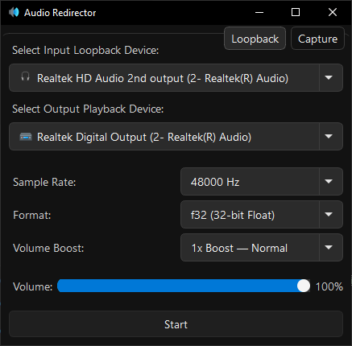
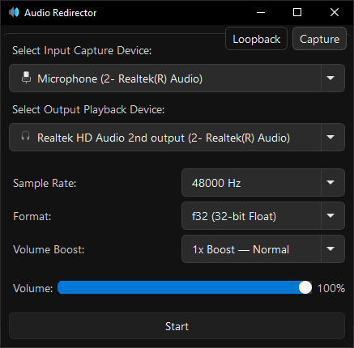

## 🔊 Audio Redirector: Redirect audio from one device to another

**Audio Redirector** is a simple application that lets you redirect audio from a capture or loopback device to any playback device.  

*Inspired by the need to play sound on both my speakers and headphones at the same time.*

### Application Preview: 🎧 ➝ 🔊 <small>`Loopback → Playback`</small>



### Application Preview: 🎤 ➝ 🔊 <small>`Capture → Playback`</small>



---

## ✅ Prerequisites

Before building this project, ensure the following are installed:

1. **[Visual Studio Community 2022](https://visualstudio.microsoft.com/thank-you-downloading-visual-studio/?sku=Community&rel=17)** *or* **[Visual Studio Build Tools](https://visualstudio.microsoft.com/visual-cpp-build-tools/)**
2. **Desktop Development with C++** workload (Install via the Visual Studio Installer).
3. **Windows 11 SDK** (version 10.0.22621.0 or later). Install via the Visual Studio Installer if not already available.
4. **Qt 6.9.0 or later**. Read the instructions below for getting Qt.
---

## 🛠️ Getting Qt

To build and run this project, you need to have Qt installed. You can download it from one of the following sources:

* 🌐 **Official Online Installer:** https://www.qt.io/download-qt-installer
* 📦 **Official Release Archives (for offline/older versions):** https://download.qt.io/official_releases/qt

### 🌏 Mirror Selection

When downloading Qt, it's often faster to use a local mirror. For users in **India**, we recommend:

* 🇯🇵 JAIST Mirror: https://ftp.jaist.ac.jp/pub/qtproject

You can explicitly set a mirror when launching the installer. For example:

```bash
qt-online-installer-windows-x64-4.9.0.exe --mirror https://ftp.jaist.ac.jp/pub/qtproject
```

📝 Replace the installer name with the version you've downloaded, if different.

---

## 🧱 Building the Project

Follow these steps to build project using VS Code:

1. **Open the Project in VS Code.**
2. **Install the [CMake Tools extension](https://marketplace.visualstudio.com/items?itemName=ms-vscode.cmake-tools).**
3. **Configure & Build:**
   - Open the command palette (`Ctrl+Shift+P`) and run **CMake: Configure**.
   - After configuration completes, run **CMake: Build**.

---

## ❗ Troubleshooting

* **Missing Dependencies:**
  Double-check that the required Visual Studio workload and Windows SDK are installed.

* **Build Errors Related to Qt:**
  Ensure Qt is properly installed and its path is correctly referenced in your CMake configuration or CMake presets.

* **CMake Not Detected in VS Code:**
  Try reloading the window or verifying your vscode extension and kit configuration.
